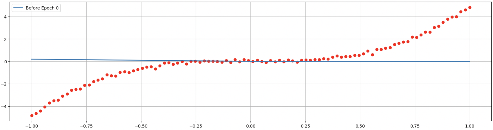
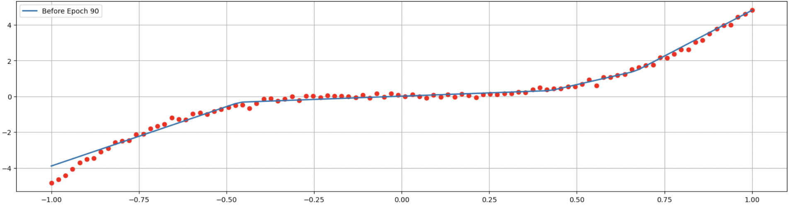

# Rust Neural Network Library

This neural network library is implemented in Rust with Python bindings. It was created as an educational project to deepen my understanding of neural network internals and Rust programming.

## Features

- **Neural Network Core:** Core implementation in Rust for performance and safety. At least that's the goal.
- **Python Bindings:** Accessible from Python for ease of use and integration with Python-based data science tools.
- **Jupyter Notebook Demos:** Examples provided in Jupyter notebooks to demonstrate usage.

## Components

- `Matrix`: A class for representing the data matrices.
- `NeuralNetwork`: The main class used for building and managing the neural network architecture.
- `Optimizer`: Handles the optimization of the neural network using gradient descent. Currently, only Mean Squared Error (MSE) is supported as the objective function.

## Getting Started

### Prerequisites

- Rust
- Python 3.x
- Jupyter Notebook
- [Maturin](https://github.com/PyO3/maturin) for building Python extensions

It is recommended to use a virtual environment like conda to manage Python dependencies.

### Building the Library

To compile the Rust library, use:

```bash
cargo build
```

### Testing

To run tests, use

```bash
cargo test
```

**_Note that tests may fail to run if you are within a python virtual environment depending on environment setup. Make sure to `deactivate` virtual environment before running tests._**

### Using the Python Bindings

Navigate to `py_nn/`

```bash
cd py_nn
```

Activate a Python virtual environment then install the Python module with maturin

```bash
maturin develop --features "extension-module"
```

**_For the maturin command to work, you have to be within a virtual python environment to begin with._** The module `py_nn` will then be added to the virtual environment.

### Jupyter Notebook Demos

To view Jupyter notebook demos, navigate to the `py_examples/` directory. Examples indclude:

- `linear.ipynb` : Demonstrates a simple linear function fit.
- `cubic.ipynb`: Demonstrates a cubic function fit using `ReLU` activation function.

In `cubic.ipynb`, sample was generated as synthetic data of a cubic function + some noise. To fit the data, a simple neural network of:

- two fully-connected layers, and
- one ReLU activation layer

was used. Here is the NN function + data before training:



And here's the fitted NN function after a bit of training


